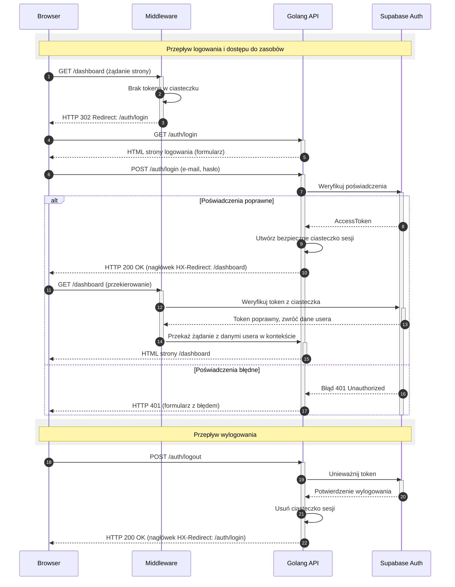

<authentication_analysis>

### 1. Przepływy autentykacji

Na podstawie dostarczonych dokumentów zidentyfikowano następujące przepływy autentykacji:

- **Rejestracja użytkownika (US-001):** Użytkownik wypełnia formularz, otrzymuje e-mail weryfikacyjny, klika link, a jego konto jest aktywowane.
- **Logowanie użytkownika (US-002):** Użytkownik podaje e-mail i hasło, system weryfikuje dane, tworzy sesję (za pomocą ciasteczka) i przekierowuje go do panelu.
- **Wylogowanie użytkownika (US-003):** Użytkownik klika przycisk wylogowania, sesja jest unieważniana, a ciasteczko usuwane.
- **Odzyskiwanie hasła (US-012):** Użytkownik prosi o reset hasła, otrzymuje link na e-mail, ustawia nowe hasło za pomocą formularza.
- **Ochrona ścieżek:** Middleware sprawdza obecność i ważność tokenu w ciasteczku przy każdej próbie dostępu do chronionych zasobów.

### 2. Główni aktorzy i ich interakcje

- **Przeglądarka (Użytkownik):** Inicjuje wszystkie żądania (rejestracja, logowanie, dostęp do danych) za pomocą interfejsu opartego na htmx.
- **Golang API (Backend):** Odbiera żądania, komunikuje się z Supabase Auth, zarządza sesją (ciasteczkami) i renderuje widoki `templ`.
- **Middleware:** Działa jako strażnik przed handlerami chronionych ścieżek. Weryfikuje token sesji.
- **Supabase Auth:** Zewnętrzna usługa odpowiedzialna za zarządzanie tożsamością, weryfikację poświadczeń, wysyłanie e-maili transakcyjnych (weryfikacja, reset hasła).

### 3. Procesy weryfikacji i odświeżania tokenów

- **Weryfikacja tokenu:** Middleware przy każdym żądaniu do chronionej ścieżki odczytuje token z ciasteczka `HttpOnly` i wysyła go do Supabase Auth w celu weryfikacji (`GetUser(token)`). Jeśli token jest ważny, żądanie jest przepuszczane dalej. Jeśli jest nieważny lub wygasł, użytkownik jest przekierowywany na stronę logowania.
- **Zarządzanie sesją:** Po pomyślnym logowaniu, Golang API otrzymuje od Supabase `AccessToken` i umieszcza go w bezpiecznym ciasteczku. Wylogowanie unieważnia token w Supabase i usuwa ciasteczko z przeglądarki.
- **Odświeżanie tokenu:** Chociaż specyfikacja nie opisuje tego wprost, klient Supabase Auth zazwyczaj zarządza odświeżaniem tokenów automatycznie. W kontekście SSR, przy każdym żądaniu weryfikującym token, Supabase może zwrócić nowy token, który backend powinien następnie ustawić w ciasteczku, przedłużając sesję użytkownika.

### 4. Opis kroków autentykacji

1.  **Dostęp do strony chronionej (bez sesji):** Użytkownik próbuje wejść na `/dashboard`. Middleware nie znajduje tokenu i przekierowuje go na `/auth/login`.
2.  **Logowanie:** Użytkownik wysyła formularz z `/auth/login`. Backend przekazuje dane do Supabase.
3.  **Sukces logowania:** Supabase zwraca `AccessToken`. Backend tworzy ciasteczko sesji i odsyła nagłówek `HX-Redirect: /dashboard`.
4.  **Dostęp do strony chronionej (z sesją):** Użytkownik jest na `/dashboard` i klika, aby zobaczyć swoje feedy. Przeglądarka wysyła żądanie z ciasteczkiem.
5.  **Weryfikacja w middleware:** Middleware odczytuje token z ciasteczka, pyta Supabase, czy jest ważny. Supabase potwierdza.
6.  **Dostęp przyznany:** Middleware umieszcza dane użytkownika w kontekście i przekazuje żądanie do handlera, który zwraca listę feedów.
7.  **Wygasła sesja:** Jeśli w kroku 5 Supabase stwierdzi, że token wygasł, middleware usuwa ciasteczko i zwraca przekierowanie do `/auth/login`.

</authentication_analysis>

<mermaid_diagram>

</mermaid_diagram>
