<user_journey_analysis>

### 1. Główne ścieżki użytkownika:

- **Rejestracja nowego użytkownika:** Obejmuje wypełnienie formularza, walidację danych, wysłanie e-maila weryfikacyjnego i aktywację konta po kliknięciu w link.
- **Logowanie do aplikacji:** Umożliwia dostęp do chronionych zasobów aplikacji po podaniu poprawnych danych uwierzytelniających.
- **Wylogowywanie z aplikacji:** Kończy sesję użytkownika i zabezpiecza konto.
- **Odzyskiwanie hasła:** Pozwala użytkownikowi, który zapomniał hasła, na ustawienie nowego poprzez link wysłany na adres e-mail.
- **Korzystanie z aplikacji:** Dostęp do głównych funkcjonalności (dashboard, zarządzanie feedami, generowanie podsumowań) jako zalogowany użytkownik.

### 2. Główne podróże i stany:

- **Podróż niezalogowanego użytkownika:**
  - **Stan początkowy:** Użytkownik wchodzi na stronę.
  - **Decyzja:** Czy użytkownik ma aktywną sesję?
  - **Wynik (NIE):** Użytkownik jest przekierowywany do widoków publicznych (logowanie, rejestracja).
  - **Cel:** Umożliwienie użytkownikowi zalogowania się, zarejestrowania lub odzyskania hasła.

- **Podróż zalogowanego użytkownika:**
  - **Stan początkowy:** Użytkownik wchodzi na stronę.
  - **Decyzja:** Czy użytkownik ma aktywną sesję?
  - **Wynik (TAK):** Użytkownik jest przekierowywany do głównego panelu aplikacji (dashboard).
  - **Cel:** Umożliwienie użytkownikowi korzystania z chronionych funkcjonalności aplikacji.

### 3. Punkty decyzyjne i alternatywne ścieżki:

- **Formularz logowania:**
  - **Ścieżka główna:** Poprawne dane -> Dostęp do aplikacji.
  - **Ścieżka alternatywna:** Błędne dane -> Wyświetlenie komunikatu o błędzie.
  - **Ścieżka alternatywna:** Kliknięcie "Zapomniałeś hasła?" -> Przejście do procesu odzyskiwania hasła.
- **Formularz rejestracji:**
  - **Ścieżka główna:** Poprawne dane -> Wysłanie e-maila weryfikacyjnego.
  - **Ścieżka alternatywna:** Błędy walidacji (np. e-mail zajęty, hasła niezgodne) -> Wyświetlenie błędów w formularzu.
- **Weryfikacja e-mail:**
  - **Ścieżka główna:** Poprawny token -> Aktywacja konta i przekierowanie do logowania.
  - **Ścieżka alternatywna:** Niepoprawny/wygasły token -> Wyświetlenie strony błędu.
- **Resetowanie hasła:**
  - **Ścieżka główna:** Poprawny token i nowe hasło -> Zmiana hasła i przekierowanie do logowania.
  - **Ścieżka alternatywna:** Niepoprawny token lub błędy walidacji -> Wyświetlenie błędów.

### 4. Opis celów stanów:

- **Strona Główna (jako punkt wejścia):** Pierwszy kontakt użytkownika z aplikacją, który kieruje go dalej w zależności od stanu sesji.
- **Formularz Logowania:** Umożliwia uwierzytelnienie zarejestrowanego użytkownika.
- **Formularz Rejestracji:** Zbiera dane potrzebne do utworzenia nowego konta.
- **Oczekiwanie na Weryfikację E-mail:** Informuje użytkownika o konieczności sprawdzenia skrzynki pocztowej.
- **Potwierdzenie Konta:** Stan, w którym system aktywuje konto użytkownika.
- **Dashboard:** Główny widok aplikacji dla zalogowanego użytkownika.
- **Formularz Odzyskiwania Hasła:** Inicjuje proces resetowania hasła poprzez zebranie adresu e-mail.
- **Formularz Zmiany Hasła:** Umożliwia ustawienie nowego hasła na podstawie tokenu z e-maila.

```mermaid
stateDiagram-v2
    direction LR
    [*] --> SprawdzenieSesji

    state SprawdzenieSesji <<choice>>
    SprawdzenieSesji --> Dashboard: Sesja aktywna
    SprawdzenieSesji --> Autentykacja: Sesja nieaktywna

    state "Dostęp do Aplikacji" as Aplikacja {
        direction LR
        Dashboard --> ZarzadzanieFeedami
        Dashboard --> GenerowaniePodsumowan
        ZarzadzanieFeedami --> Dashboard
        GenerowaniePodsumowan --> Dashboard
        Dashboard --> Wylogowanie
        Wylogowanie --> [*]
    }

    state "Proces Autentykacji" as Autentykacja {
        direction TD
        [*] --> StronaLogowania

        state "Logowanie" as Logowanie {
            StronaLogowania --> ProbaLogowania: Użytkownik podaje dane
            note right of ProbaLogowania
                System weryfikuje e-mail i hasło.
            end note
            ProbaLogowania --> if_dane_poprawne <<choice>>
            if_dane_poprawne --> Aplikacja: Dane poprawne
            if_dane_poprawne --> StronaLogowania: Dane błędne
            StronaLogowania --> OdzyskiwanieHasla: Kliknięcie "Zapomniałeś hasła?"
            StronaLogowania --> Rejestracja: Kliknięcie "Zarejestruj się"
        }

        state "Rejestracja" as Rejestracja {
            [*] --> FormularzRejestracji
            note left of FormularzRejestracji
                Użytkownik podaje e-mail i hasło.
            end note
            FormularzRejestracji --> WalidacjaDanychRejestracji: Przesłanie formularza
            WalidacjaDanychRejestracji --> if_rejestracja_poprawna <<choice>>
            if_rejestracja_poprawna --> WyslanieMailaWeryfikacyjnego: Dane poprawne
            if_rejestracja_poprawna --> FormularzRejestracji: Błędy walidacji
            WyslanieMailaWeryfikacyjnego --> OczekiwanieNaWeryfikacje
            note right of OczekiwanieNaWeryfikacje
                Użytkownik jest informowany
                o konieczności sprawdzenia
                skrzynki pocztowej.
            end note
            OczekiwanieNaWeryfikacje --> WeryfikacjaTokenaEmail: Użytkownik klika link
            WeryfikacjaTokenaEmail --> if_token_email_poprawny <<choice>>
            if_token_email_poprawny --> KontoPotwierdzone: Token poprawny
            if_token_email_poprawny --> BladWeryfikacjiEmail: Token błędny/wygasł
            KontoPotwierdzone --> StronaLogowania
            BladWeryfikacjiEmail --> FormularzRejestracji
        }

        state "Odzyskiwanie Hasła" as OdzyskiwanieHasla {
            [*] --> FormularzOdzyskiwania
            note right of FormularzOdzyskiwania
                Użytkownik podaje
                swój adres e-mail.
            end note
            FormularzOdzyskiwania --> WyslanieMailaResetujacego: Przesłanie formularza
            WyslanieMailaResetujacego --> WeryfikacjaTokenaResetu: Użytkownik klika link
            WeryfikacjaTokenaResetu --> if_token_resetu_poprawny <<choice>>
            if_token_resetu_poprawny --> FormularzNowegoHasla: Token poprawny
            if_token_resetu_poprawny --> BladResetuHasla: Token błędny/wygasł
            FormularzNowegoHasla --> WalidacjaNowegoHasla: Przesłanie nowego hasła
            WalidacjaNowegoHasla --> if_haslo_poprawne <<choice>>
            if_haslo_poprawne --> HasloZmienione: Hasło poprawne
            if_haslo_poprawne --> FormularzNowegoHasla: Błędy walidacji
            HasloZmienione --> StronaLogowania
            BladResetuHasla --> StronaLogowania
        }
    }
```

</user_journey_analysis>

<mermaid_diagram>

</mermaid_diagram>
