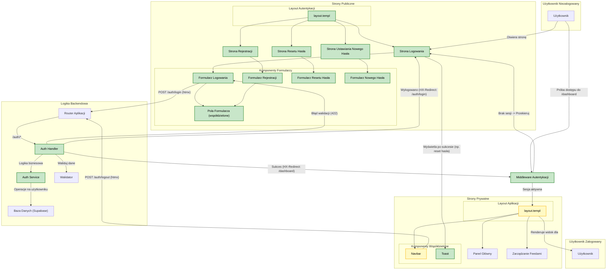

<architecture_analysis>

### 1. Lista Komponentów

Na podstawie dostarczonych plików referencyjnych, zidentyfikowano następujące kluczowe komponenty UI, które zostaną utworzone lub zaktualizowane:

**Nowe Layouty:**

- `internal/auth/view/layout.templ`: Minimalistyczny layout dla stron publicznych (logowanie, rejestracja, reset hasła), centrujący formularze na ekranie.

**Nowe Strony (Komponenty `templ`):**

- `internal/auth/view/login.templ`: Strona z formularzem logowania.
- `internal/auth/view/register.templ`: Strona z formularzem rejestracji.
- `internal/auth/view/forgot_password.templ`: Strona z formularzem inicjującym reset hasła.
- `internal/auth/view/reset_password.templ`: Strona z formularzem do ustawienia nowego hasła.
- `internal/auth/view/registration_pending.templ`: Komponent wyświetlany po wysłaniu formularza rejestracji, informujący o konieczności weryfikacji e-mail.

**Nowe lub Zmodyfikowane Komponenty Współdzielone:**

- `internal/auth/view/form_fields.templ`: Współdzielone pola formularzy (e-mail, hasło) z logiką walidacji.
- `internal/shared/view/layout.templ` (Aktualizacja): Główny layout aplikacji, używany wyłącznie dla zalogowanych użytkowników. Usunięty zostanie wariant `non-auth`.
- `internal/shared/view/components/navbar.templ` (Aktualizacja): Pasek nawigacji, który teraz zawsze będzie wyświetlał dane użytkownika i przycisk wylogowania, ponieważ będzie używany tylko w layoucie dla zalogowanych.
- `internal/shared/view/components/toast.templ`: Komponent do wyświetlania powiadomień (np. "Rejestracja pomyślna").

### 2. Główne Strony i Ich Komponenty

- **Strona Logowania (`/auth/login`):**
  - Używa `auth/view/layout.templ`.
  - Renderuje `auth/view/login.templ`, który z kolei używa `auth/view/form_fields.templ`.
- **Strona Rejestracji (`/auth/register`):**
  - Używa `auth/view/layout.templ`.
  - Renderuje `auth/view/register.templ`, który używa `auth/view/form_fields.templ`.
- **Strona "Zapomniałem Hasła" (`/auth/forgot-password`):**
  - Używa `auth/view/layout.templ`.
  - Renderuje `auth/view/forgot_password.templ`.
- **Strona Resetowania Hasła (`/auth/reset-password`):**
  - Używa `auth/view/layout.templ`.
  - Renderuje `auth/view/reset_password.templ`.
- **Panel Główny / Dashboard (`/dashboard`):**
  - Używa zaktualizowanego `shared/view/layout.templ`.
  * Zawiera `shared/view/components/navbar.templ`.
  - Renderuje widok panelu głównego (np. `dashboard/view/index.templ`).

### 3. Przepływ Danych

Przepływ danych opiera się na interakcjach htmx, które wywołują endpointy backendowe i zamieniają fragmenty HTML bez przeładowywania strony.

1.  **Użytkownik -> Formularz (np. Logowania)**: Użytkownik wypełnia dane.
2.  **Formularz -> Backend (`POST /auth/login`)**: htmx wysyła żądanie POST z danymi formularza.
3.  **Backend -> Formularz (Błąd Walidacji)**: W przypadku błędu, backend zwraca kod 4xx i ponownie renderuje komponent formularza z dołączonymi komunikatami o błędach. htmx podmienia istniejący formularz nową wersją.
4.  **Backend -> Przeglądarka (Sukces)**: W przypadku sukcesu, backend zwraca kod 200 z nagłówkiem `HX-Redirect`, który instruuje htmx po stronie klienta, aby przekierować na nową stronę (np. `/dashboard`).
5.  **Dostęp do strony chronionej (`/dashboard`)**: Middleware autentykacji (`shared/auth/middleware.go`) przechwytuje żądanie, weryfikuje token z ciasteczka, a następnie albo zezwala na dostęp, renderując stronę z `shared/view/layout.templ`, albo przekierowuje na `/auth/login`.

### 4. Opis Funkcjonalności Komponentów

- **`auth/view/layout.templ`**: Zapewnia spójny, minimalistyczny wygląd dla wszystkich stron związanych z procesem autentykacji.
- **`shared/view/layout.templ`**: Główny szablon aplikacji dla zalogowanych użytkowników, zawierający nawigację i główną treść strony.
- **`login.templ` / `register.templ`**: Renderują formularze i obsługują logikę interakcji (wysyłanie danych, wyświetlanie błędów) za pomocą atrybutów htmx.
- **`navbar.templ`**: Wyświetla nawigację, e-mail użytkownika i przycisk "Wyloguj", który wysyła żądanie `POST /auth/logout`.
- **`toast.templ`**: Służy do wyświetlania krótkich, globalnych powiadomień o sukcesie lub błędzie (np. po pomyślnej zmianie hasła).
- **Middleware Autentykacji**: Nie jest komponentem UI, ale kluczowym elementem logiki, który decyduje, który layout i stronę wyświetlić w zależności od stanu sesji użytkownika.

</architecture_analysis>

<mermaid_diagram>

</mermaid_diagram>
